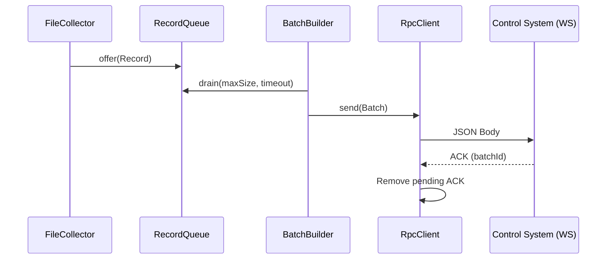
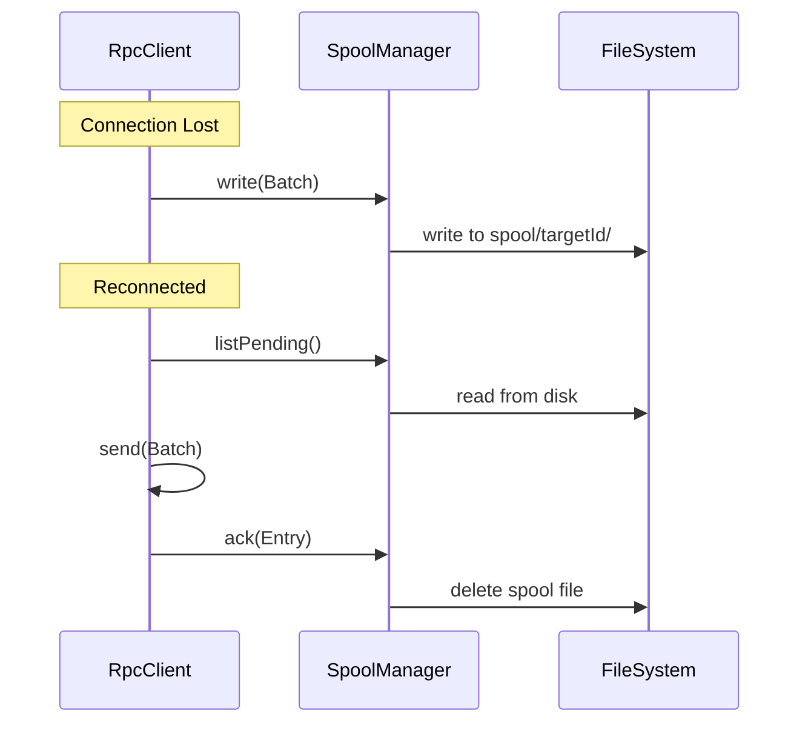
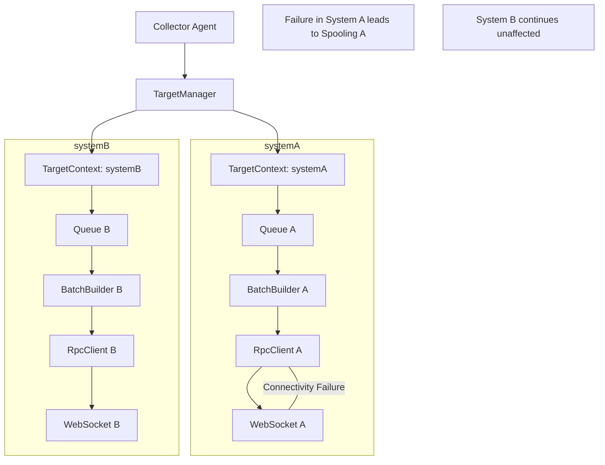

# Java Lightweight Collector Agent

A production-grade, lightweight Java Collector Agent (Pure Java, no Spring Boot).

## Features
- **Multi-Target Isolation**: 1 Agent → N Control Systems. Failure in one target does not affect others.
- **TLS/mTLS Support**: Certificate-based security for WebSocket connections.
- **Durable Persistence**: File-based position store (no SQLite) and disk spooling on network failure.
- **At-least-once Delivery**: Guaranteed delivery via ACK handling and retry logic.
- **Cross-Platform**: Tested on Windows and Linux.

## Prerequisites
- JDK 17+
- Gradle (optional, wrapper included)

## Build
To build the fat jar:
```powershell
./gradlew shadowJar
```
The output jar will be in `build/libs/collector-agent.jar`.

## Run
```powershell
java -jar build/libs/collector-agent.jar -c config/config.yaml
```

## Health check
```powershell
curl http://localhost:8080/health
```

## Architecture Flow

### Normal Flow


### Spool Recovery Flow


## Target Isolation Flow

"# icon-agent" 
